Das Paket `ggplot2`
-------------------

-   Entwickelt von Hadley Wickham
-   Viele Informationen unter:
-   <http://ggplot2.org/>
-   Den Graphiken liegt eine eigene Grammitik zu Grunde

[Basiseinführung `ggplot2`](www.r-bloggers.com/basic-introduction-to-ggplot2/)
------------------------------------------------------------------------------

&lt;www.r-bloggers.com/basic-introduction-to-ggplot2/&gt;

    install.packages("ggplot2")

    library(ggplot2)

Der `diamonds` Datensatz
------------------------

    head(diamonds)

<table>
<thead>
<tr class="header">
<th align="right">carat</th>
<th align="left">cut</th>
<th align="left">color</th>
<th align="left">clarity</th>
<th align="right">depth</th>
<th align="right">table</th>
<th align="right">price</th>
<th align="right">x</th>
<th align="right">y</th>
<th align="right">z</th>
</tr>
</thead>
<tbody>
<tr class="odd">
<td align="right">0.23</td>
<td align="left">Ideal</td>
<td align="left">E</td>
<td align="left">SI2</td>
<td align="right">61.5</td>
<td align="right">55</td>
<td align="right">326</td>
<td align="right">3.95</td>
<td align="right">3.98</td>
<td align="right">2.43</td>
</tr>
<tr class="even">
<td align="right">0.21</td>
<td align="left">Premium</td>
<td align="left">E</td>
<td align="left">SI1</td>
<td align="right">59.8</td>
<td align="right">61</td>
<td align="right">326</td>
<td align="right">3.89</td>
<td align="right">3.84</td>
<td align="right">2.31</td>
</tr>
<tr class="odd">
<td align="right">0.23</td>
<td align="left">Good</td>
<td align="left">E</td>
<td align="left">VS1</td>
<td align="right">56.9</td>
<td align="right">65</td>
<td align="right">327</td>
<td align="right">4.05</td>
<td align="right">4.07</td>
<td align="right">2.31</td>
</tr>
<tr class="even">
<td align="right">0.29</td>
<td align="left">Premium</td>
<td align="left">I</td>
<td align="left">VS2</td>
<td align="right">62.4</td>
<td align="right">58</td>
<td align="right">334</td>
<td align="right">4.20</td>
<td align="right">4.23</td>
<td align="right">2.63</td>
</tr>
<tr class="odd">
<td align="right">0.31</td>
<td align="left">Good</td>
<td align="left">J</td>
<td align="left">SI2</td>
<td align="right">63.3</td>
<td align="right">58</td>
<td align="right">335</td>
<td align="right">4.34</td>
<td align="right">4.35</td>
<td align="right">2.75</td>
</tr>
<tr class="even">
<td align="right">0.24</td>
<td align="left">Very Good</td>
<td align="left">J</td>
<td align="left">VVS2</td>
<td align="right">62.8</td>
<td align="right">57</td>
<td align="right">336</td>
<td align="right">3.94</td>
<td align="right">3.96</td>
<td align="right">2.48</td>
</tr>
</tbody>
</table>

Wie nutzt man `qplot`
---------------------

-   Die Funktion `qplot` wird für schnelle Graphiken verwendet
    (quick plots)
-   bei der Funktion `ggplot` kann man alles bis ins Detail
    kontrollieren

<!-- -->

    # histogram
    qplot(depth, data=diamonds)

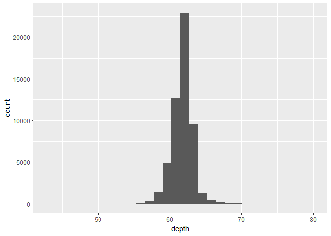

Ein Balkendiagramm
------------------

    qplot(cut, depth, data=diamonds)

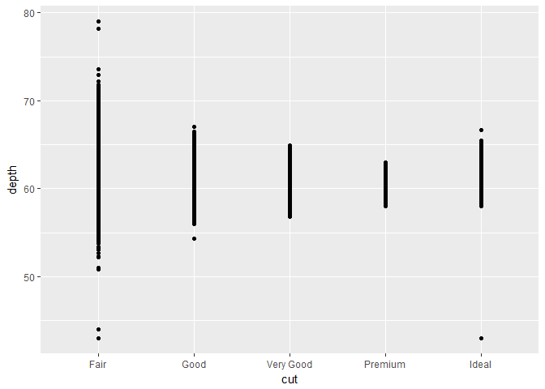

Ein weiteres Balkendiagramm
---------------------------

    qplot(factor(cyl), data=mtcars,geom="bar")

Boxplot
-------

    qplot(data=diamonds,x=cut,y=depth,geom="boxplot")

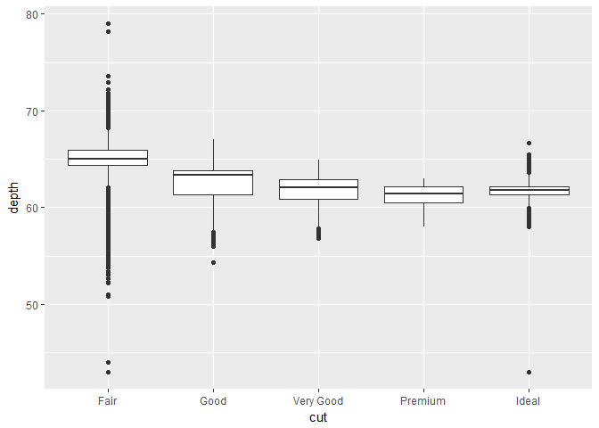

Scatterplot
-----------

    # scatterplot
    qplot(carat, depth, data=diamonds)

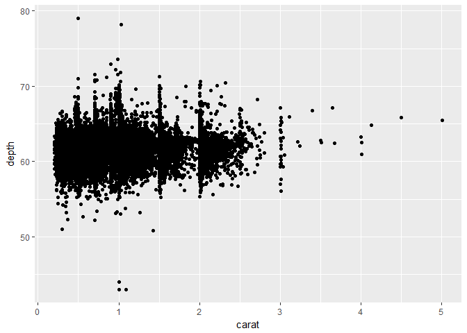

Farbe hinzu:
------------

    qplot(carat, depth, data=diamonds,color=cut)

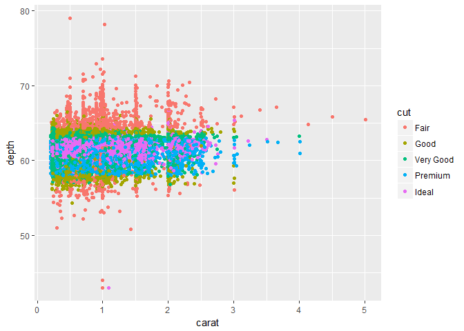

Trendlinie hinzufügen
---------------------

    myGG<-qplot(data=diamonds,x=carat,y=depth,color=carat) 
    myGG + stat_smooth(method="lm")

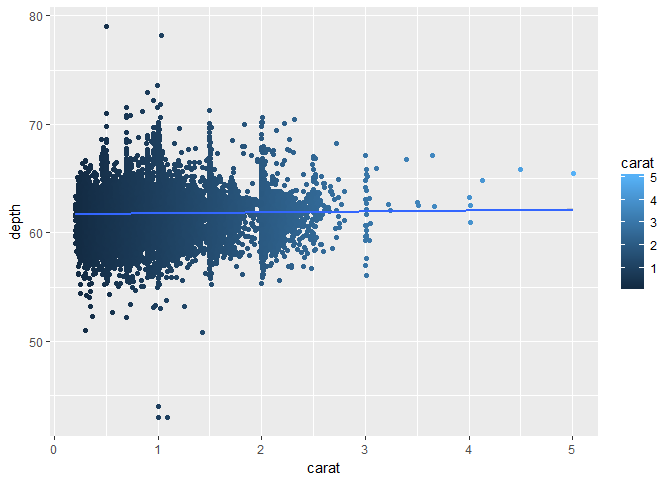

Graphik drehen
--------------

    qplot(factor(cyl), data=mtcars, geom="bar") + 
    coord_flip()

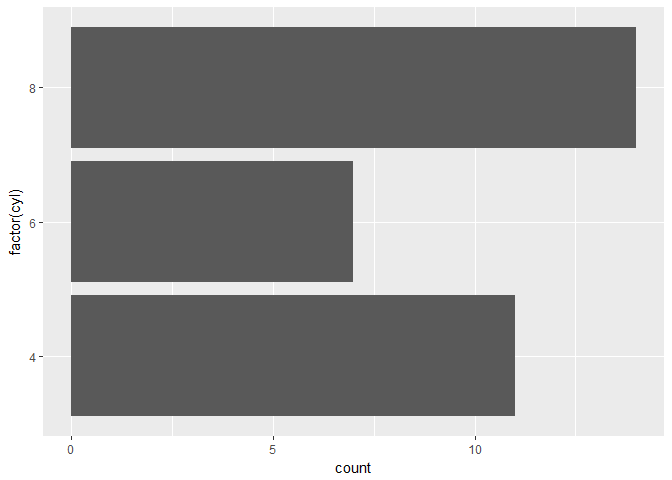

Wie nutzt man ggplot
--------------------

-   die aestetics:

<!-- -->

    ggplot(diamonds, aes(clarity, fill=cut)) + geom_bar()

Farben selber wählen
--------------------

Es wird das Paket `RColorBrewer` verwendet um die Farbpalette zu ändern

    install.packages("RColorBrewer")

    library(RColorBrewer)
    myColors <- brewer.pal(5,"Accent")
    names(myColors) <- levels(diamonds$cut)
    colScale <- scale_colour_manual(name = "cut",
                                    values = myColors)

<http://stackoverflow.com/questions/6919025/>

Eine Graphik mit den gewählten Farben
-------------------------------------

    p <- ggplot(diamonds,aes(carat, depth,colour = cut)) + 
      geom_point()
    p + colScale

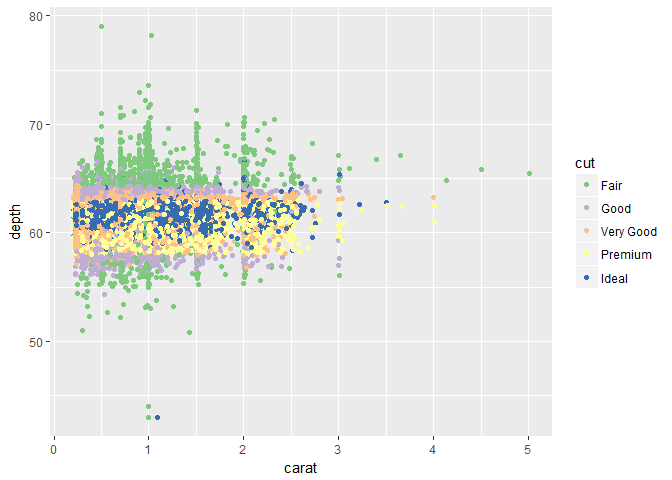

Speichern mit ggsave
--------------------

    ggsave("Graphik.jpg")

Links
-----

-   [Warum man ggplot2 für einfache Grafiken nutzen
    sollte](http://www.r-bloggers.com/why-i-use-ggplot2/)

-   [Einführung in
    ggplot2](https://opr.princeton.edu/workshops/Downloads/2015Jan_ggplot2Koffman.pdf)

- [ggplot2
Basics](http://tutorials.iq.harvard.edu/R/Rgraphics/Rgraphics.html)

-   Noam Ross - [Quick Introduction to
    ggplot2](http://www.noamross.net/blog/2012/10/5/ggplot-introduction.html)

-   [Plugin
    ggplot2](https://www.r-bloggers.com/rcmdrplugin-kmggplot2_0-2-4-is-on-cran/)

Gliederung
----------

Arten von räumlichen Daten:

-   [Straßenkarten](https://www.nceas.ucsb.edu/~frazier/RSpatialGuides/ggmap/ggmapCheatsheet.pdf)
-   [Satelliten Bilder](http://www.mostlymuppet.com/tag/maps/)
-   [Physische Daten und
    Karten](http://gis.stackexchange.com/questions/3083/what-makes-a-map-beautiful/45518#45518)
-   [Abstrakte
    Karten](http://www.designfaves.com/2014/03/abstracted-maps-reveal-cities-personalities)
-   ...

Das R-paket
[ggmap](http://journal.r-project.org/archive/2013-1/kahle-wickham.pdf)
wird im folgenden genutzt um verschiedene Kartentypen darzustellen.

Mit [qmap](http://www.inside-r.org/packages/cran/ggmap/docs/qmap) kann
man eine schnelle Karte erzeugen.

Straßenkarten
-------------

-   Straßenkarte werden sehr häufig verwendet.
-   Diese Karten zeigen Haupt- und Nebenstraßen (abhängig vom Detail)
-   oft sind auch weitere Informationen enthalten. Wie beispielsweise
    Flughäfen, Städte, Campingplätze oder andere Orte von Interesse
-   Beispiel einer Straßenkarte für
    [Mannheim](http://rpubs.com/Japhilko82/OpenStreetMap_Mannheim).

Installieren des Paketes
------------------------

-   Zur Erstellung der Karten brauchen wir das Paket `ggmap`:

<!-- -->

    devtools::install_github("dkahle/ggmap")
    devtools::install_github("hadley/ggplot2")
    install.packages("ggmap")

Paket ggmap - Hallo Welt
------------------------

-   Um das Paket zu laden verwenden wir den Befehl `library`

<!-- -->

    library(ggmap)

Und schon kann die erste Karte erstellt werden:

    qmap("Mannheim")

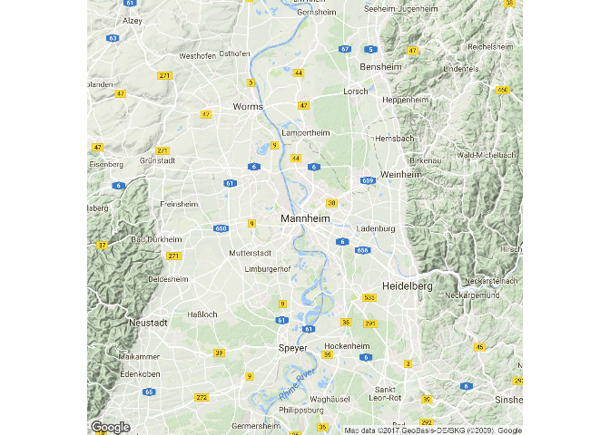

Karte für eine Sehenswürdigkeit
-------------------------------

    BBT <- qmap("Berlin Brandenburger Tor")
    BBT

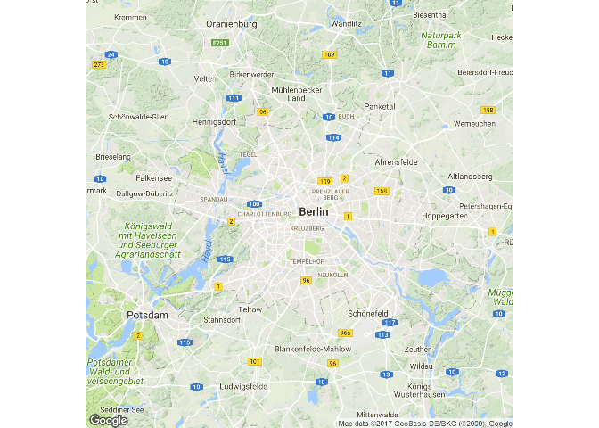

Karte für einen ganzen Staat
----------------------------

    qmap("Germany")

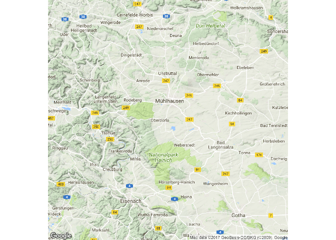

-   Wir brauchen ein anderes *zoom level*

Ein anderes *zoom level*
------------------------

-   level 3 - Kontinent
-   level 10 - Stadt
-   level 21 - Gebäude

<!-- -->

    qmap("Germany", zoom = 6)

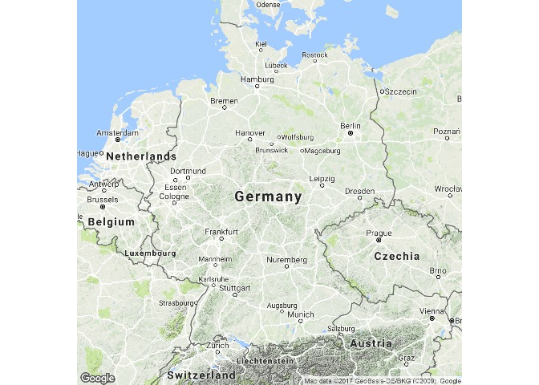

Hilfe bekommen wir mit dem Fragezeichen
---------------------------------------

    ?qmap

Verschiedene Abschnitte in der Hilfe:

-   Description
-   Usage
-   Arguments
-   Value
-   Author(s)
-   See Also
-   Examples

Die Beispiele in der Hilfe
--------------------------

Ausschnitt aus der Hilfe Seite zum Befehl `qmap`:

Das Beispiel kann man direkt in die Konsole kopieren:

    # qmap("baylor university")
    qmap("baylor university", zoom = 14)
    # und so weiter

Ein anderes *zoom level*
------------------------

    qmap("Mannheim", zoom = 12)

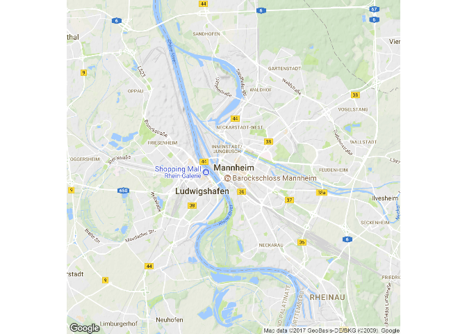

Näher rankommen
---------------

    qmap('Mannheim', zoom = 13)

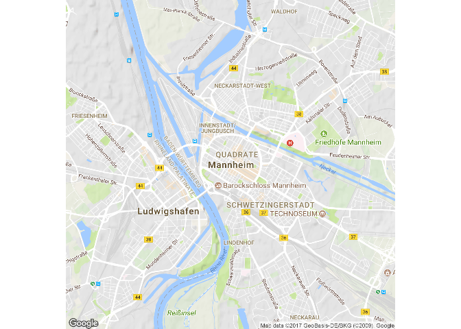

Ganz nah dran
-------------

    qmap('Mannheim', zoom = 20)

ggmap - maptype satellite
-------------------------

    qmap('Mannheim', zoom = 14, maptype="satellite")

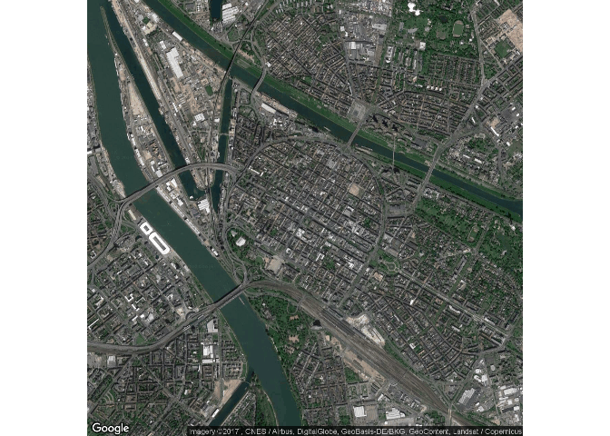

ggmap - maptype satellite zoom 20
---------------------------------

    qmap('Mannheim', zoom = 20, maptype="hybrid")

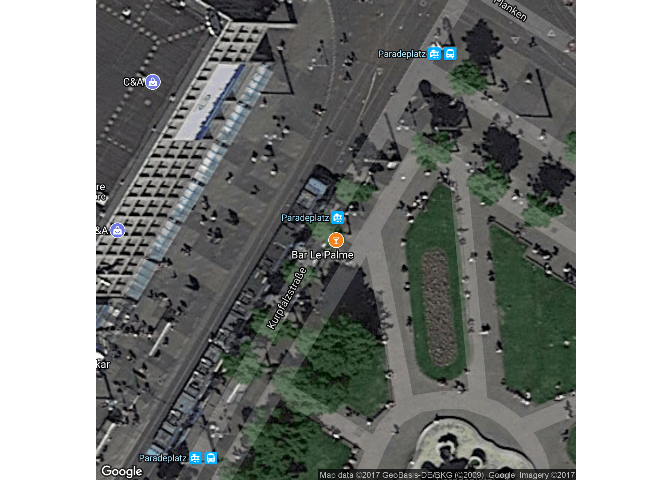

ggmap - maptype hybrid
----------------------

    qmap("Mannheim", zoom = 14, maptype="hybrid")

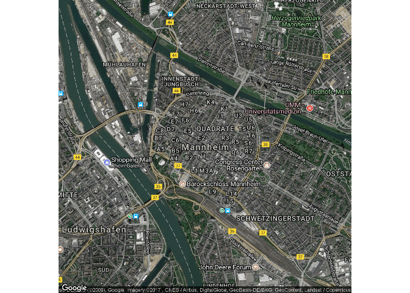

Terrain/physical maps
---------------------

-   Aus Physischen Karten kann man Informationen über Berge, Flüsse und
    Seen ablesen.

-   Farben werden oft genutzt um Höhenunterschiede zu visualisieren

ggmap - terrain map
-------------------

    qmap('Schriesheim', zoom = 14,maptype="terrain")

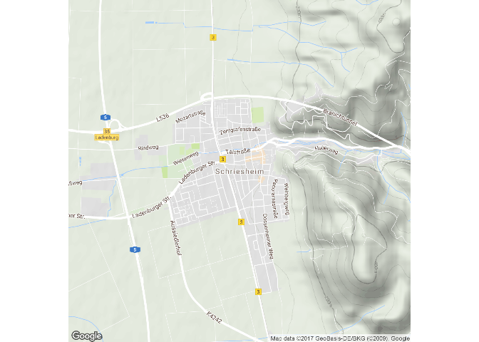

Abstrahierte Karten ([http://www.designfaves.com](http://www.designfaves.com/2014/03/abstracted-maps-reveal-cities-personalities))
----------------------------------------------------------------------------------------------------------------------------------

-   Abstraktion wird genutzt um nur die essentiellen Informationen einer
    Karte zu zeigen.

-   Bsp. U-Bahn Karten - wichtig sind Richtungen und wenig Infos zur
    Orientierung

-   Im folgenden werden Karten vorgestellt, die sich gut als
    Hintergrundkarten eignen.

ggmap - maptype watercolor
--------------------------

    qmap('Mannheim', zoom = 14,maptype="watercolor",source="stamen")

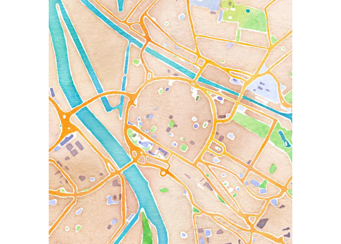

ggmap - source stamen
---------------------

    qmap('Mannheim', zoom = 14,
     maptype="toner",source="stamen")

ggmap - maptype toner-lite
--------------------------

    qmap('Mannheim', zoom = 14,
     maptype="toner-lite",source="stamen")

ggmap - maptype toner-hybrid
----------------------------

    qmap('Mannheim', zoom = 14,
     maptype="toner-hybrid",source="stamen")

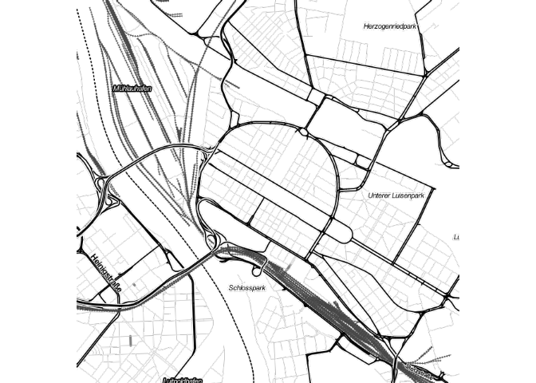

ggmap - maptype terrain-lines
-----------------------------

    qmap('Mannheim', zoom = 14,
     maptype="terrain-lines",source="stamen")

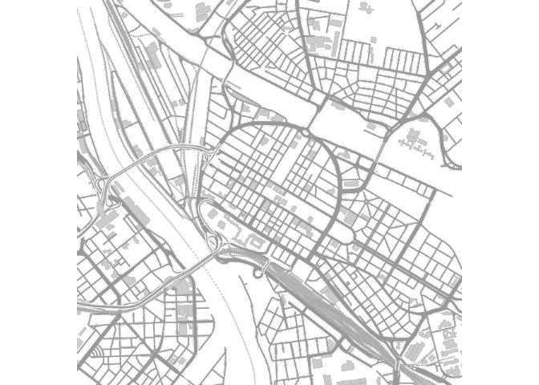

Graphiken speichern
-------------------

ggmap - ein Objekt erzeugen
---------------------------

-   `<-` ist der Zuweisungspfeil um ein Objekt zu erzeugen
-   Dieses Vorgehen macht bspw. Sinn, wenn mehrere Karten nebeneinander
    gebraucht werden.

<!-- -->

    MA_map <- qmap('Mannheim', 
                   zoom = 14,
                   maptype="toner",
                   source="stamen")

Geokodierung
------------

> Geocoding (...) uses a description of a location, most typically a
> postal address or place name, to find geographic coordinates from
> spatial reference data ...

[Wikipedia -
Geocoding](https://github.com/adam-p/markdown-here/wiki/Markdown-Cheatsheet#blockquotes)

    library(ggmap)
    geocode("Mannheim",source="google")

<table>
<thead>
<tr class="header">
<th align="right">lon</th>
<th align="right">lat</th>
</tr>
</thead>
<tbody>
<tr class="odd">
<td align="right">8.463182</td>
<td align="right">49.48608</td>
</tr>
</tbody>
</table>

Latitude und Longitude
----------------------

[http://modernsurvivalblog.com](http://modernsurvivalblog.com/survival-skills/basic-map-reading-latitude-longitude/)

Koordinaten verschiedener Orte in Deutschland
---------------------------------------------

<table>
<thead>
<tr class="header">
<th align="left">cities</th>
<th align="right">lon</th>
<th align="right">lat</th>
</tr>
</thead>
<tbody>
<tr class="odd">
<td align="left">Hamburg</td>
<td align="right">9.993682</td>
<td align="right">53.55108</td>
</tr>
<tr class="even">
<td align="left">Koeln</td>
<td align="right">NA</td>
<td align="right">NA</td>
</tr>
<tr class="odd">
<td align="left">Dresden</td>
<td align="right">13.737262</td>
<td align="right">51.05041</td>
</tr>
<tr class="even">
<td align="left">Muenchen</td>
<td align="right">11.581981</td>
<td align="right">48.13513</td>
</tr>
</tbody>
</table>

Reverse Geokodierung
--------------------

> Reverse geocoding is the process of back (reverse) coding of a point
> location (latitude, longitude) to a readable address or place name.
> This permits the identification of nearby street addresses, places,
> and/or areal subdivisions such as neighbourhoods, county, state, or
> country.

Quelle: [Wikipedia](https://en.wikipedia.org/wiki/Reverse_geocoding)

    revgeocode(c(48,8))

    ## [1] "Unnamed Road, Somalia"

Die Distanz zwischen zwei Punkten
---------------------------------

    mapdist("Q1, 4 Mannheim","B2, 1 Mannheim")

    ##             from             to   m    km     miles seconds  minutes
    ## 1 Q1, 4 Mannheim B2, 1 Mannheim 749 0.749 0.4654286     215 3.583333
    ##        hours
    ## 1 0.05972222

    mapdist("Q1, 4 Mannheim","B2, 1 Mannheim",mode="walking")

    ##             from             to   m    km     miles seconds minutes  hours
    ## 1 Q1, 4 Mannheim B2, 1 Mannheim 546 0.546 0.3392844     423    7.05 0.1175

Eine andere Distanz bekommen
----------------------------

    mapdist("Q1, 4 Mannheim","B2, 1 Mannheim",mode="bicycling")

    ##             from             to   m    km    miles seconds  minutes
    ## 1 Q1, 4 Mannheim B2, 1 Mannheim 555 0.555 0.344877     215 3.583333
    ##        hours
    ## 1 0.05972222

Geokodierung - verschiedene Punkte von Interesse
------------------------------------------------

    POI1 <- geocode("B2, 1 Mannheim",source="google")
    POI2 <- geocode("Hbf Mannheim",source="google")
    POI3 <- geocode("Mannheim, Friedrichsplatz",source="google")
    ListPOI <-rbind(POI1,POI2,POI3)
    POI1;POI2;POI3

    ##        lon      lat
    ## 1 8.462844 49.48569

    ##        lon      lat
    ## 1 8.469879 49.47972

    ##        lon      lat
    ## 1 8.475208 49.48326

Punkte in der Karte
-------------------

    MA_map +
    geom_point(aes(x = lon, y = lat),
    data = ListPOI)

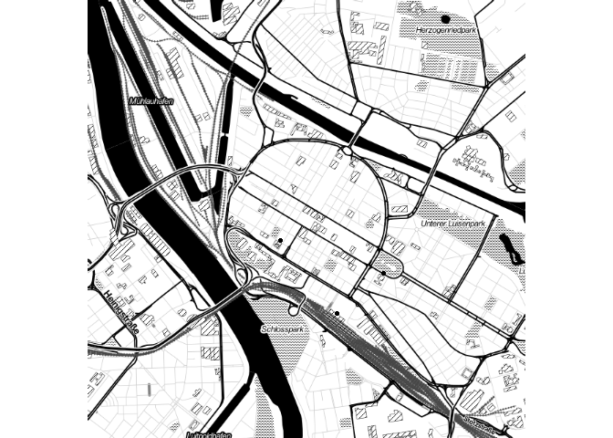

Punkte in der Karte
-------------------

    MA_map +
    geom_point(aes(x = lon, y = lat),col="red",
    data = ListPOI)

ggmap - verschiedene Farben
---------------------------

    ListPOI$color <- c("A","B","C")
    MA_map +
    geom_point(aes(x = lon, y = lat,col=color),
    data = ListPOI)

ggmap - größere Punkte
----------------------

    ListPOI$size <- c(10,20,30)
    MA_map +
    geom_point(aes(x = lon, y = lat,col=color,size=size),
    data = ListPOI)

Eine Route von Google maps bekommen
-----------------------------------

    from <- "Mannheim Hbf"
    to <- "Mannheim B2 , 1"
    route_df <- route(from, to, structure = "route")

[Mehr
Information](http://rpackages.ianhowson.com/cran/ggmap/man/route.html)

<http://rpackages.ianhowson.com/cran/ggmap/man/route.html>

Eine Karte mit dieser Information zeichnen
------------------------------------------

    qmap("Mannheim Hbf", zoom = 14) +
      geom_path(
        aes(x = lon, y = lat),  colour = "red", size = 1.5,
        data = route_df, lineend = "round"
      )

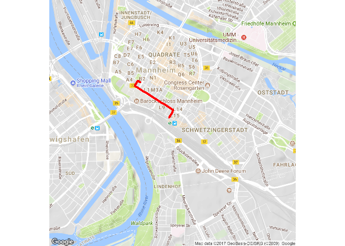

Wie fügt man Punkte hinzu

-   Nutzung von
    [geom\_point](http://zevross.com/blog/2014/07/16/mapping-in-r-using-the-ggplot2-package/)

-   Question on
    [stackoverflow](http://stackoverflow.com/questions/15069963/getting-a-map-with-points-using-ggmap-and-ggplot2)

<http://i.stack.imgur.com>

Cheatsheet
----------

-   Cheatsheet zu [data
    visualisation](https://www.rstudio.com/wp-content/uploads/2015/04/ggplot2-cheatsheet.pdf)

<https://www.rstudio.com/>

Resourcen und Literatur
-----------------------

-   [Artikel von David Kahle und Hadley
    Wickham](http://journal.r-project.org/archive/2013-1/kahle-wickham.pdf)
    zur Nutzung von `ggmap`.

-   [Schnell eine Karte
    bekommen](http://rpackages.ianhowson.com/cran/ggmap/man/get_map.html)

-   [Karten machen mit
    R](http://www.kevjohnson.org/making-maps-in-r-part-2/)

-   [Problem mit der Installation von
    ggmap](http://stackoverflow.com/questions/40642850/ggmap-error-geomrasterann-was-built-with-an-incompatible-version-of-ggproto)

Take Home Message
-----------------

Was klar sein sollte:

-   Wie man eine schnelle Karte erzeugt
-   Wie man geokodiert
-   Wie man eine Distanz berechnet
