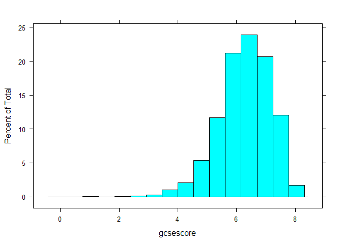
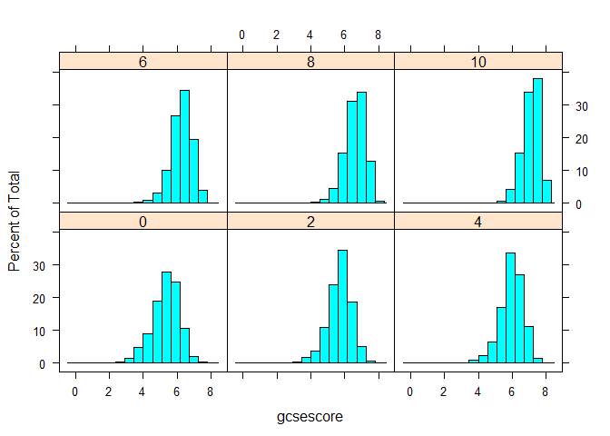

Das lattice-Paket
-----------------

> It is designed to meet most typical graphics needs with minimal
> tuning, but can also be easily extended to handle most nonstandard
> requirements.

<http://stat.ethz.ch/R-manual/R-devel/library/lattice/html/Lattice.html>

Histogramm mit Lattice
----------------------

    library("lattice")
    library("mlmRev")
    data(Chem97)
    histogram(~ gcsescore, data = Chem97)

Histogramm mit Lattice
----------------------

      histogram(~ gcsescore | factor(score),data = Chem97)

Die Dichte mit Lattice zeichnen
-------------------------------

    densityplot(~ gcsescore | factor(score), Chem97, 
        groups=gender,plot.points=FALSE,auto.key=TRUE)

[Einführung in das Paket
lattice](http://www.isid.ac.in/~deepayan/R-tutorials/labs/04_lattice_lab.pdf)

Boxplot mit Lattice zeichnen
----------------------------

    bwplot(factor(score) ~ gcsescore | gender, Chem97)

Boxplot mit Lattice zeichnen
----------------------------

    bwplot(gcsescore ~ gender | factor(score), Chem97,
     layout = c(6, 1))

Univariate Plots
----------------

    barchart(yield ~ variety | site, data = barley,
             groups = year, layout = c(1,6), stack = TRUE,
             auto.key = list(space = "right"),
             ylab = "Barley Yield (bushels/acre)",
             scales = list(x = list(rot = 45)))

Densityplot
-----------

    densityplot( ~ height | voice.part, data = singer, layout = c(2, 4),  
                xlab = "Height (inches)", bw = 5)

Bivariate Plots
---------------

    qq(gender ~ gcsescore | factor(score), Chem97,
       f.value = ppoints(100), type = c("p", "g"), aspect = 1)

xyplot
------

    xyplot(Sepal.Length + Sepal.Width ~ Petal.Length + Petal.Width | Species,
           data = iris, scales = "free", layout = c(2, 2),
           auto.key = list(x = .6, y = .7, corner = c(0, 0)))

Multivariate Plots
------------------

    splom(~iris[1:4], groups = Species, data = iris)

    super.sym <- trellis.par.get("superpose.symbol")
    splom(~iris[1:4], groups = Species, data = iris,
          panel = panel.superpose,
          key = list(title = "Three Varieties of Iris",
                     columns = 3, 
                     points = list(pch = super.sym$pch[1:3],
                     col = super.sym$col[1:3]),
                     text = list(c("Setosa", "Versicolor", "Virginica"))))

parallelplot
------------

    parallelplot(~iris[1:4] | Species, iris)

Lattice Befehle
---------------

-   [Übersicht aller Lattice
    Befehle](http://www.isid.ac.in/~deepayan/R-tutorials/labs/04_lattice_lab.pdf)
