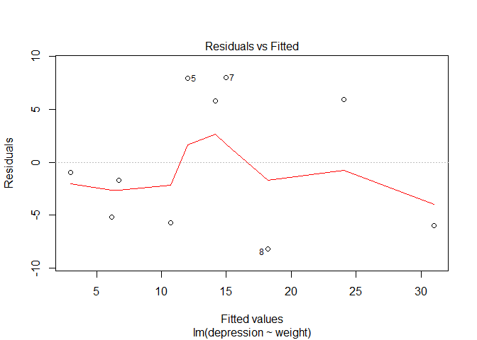

Die lineare Regression
----------------------

Maindonald -
[DataAnalysis](https://cran.r-project.org/doc/contrib/usingR.pdf)

-   Einführung in R
-   Datenanalyse
-   Statistische Modelle
-   Inferenzkonzepte
-   Regression mit einem Prädiktor
-   Multiple lineare Regression
-   Ausweitung des linearen Modells
-   ...

Lineare Regression in R - Beispieldatensatz
-------------------------------------------

John H. Maindonald and W. John Braun

DAAG - [Data Analysis and Graphics Data and
Functions](http://cran.ms.unimelb.edu.au/web/packages/DAAG/DAAG.pdf)

    install.packages("DAAG")

    library("DAAG")
    data(roller)

help on roller data:

    ?roller

Das lineare Regressionsmodell in R
----------------------------------

Schätzen eines Regressionsmodells:

    roller.lm <- lm(depression ~ weight, data = roller)

So bekommt man die Schätzwerte:

    summary(roller.lm)

    ## 
    ## Call:
    ## lm(formula = depression ~ weight, data = roller)
    ## 
    ## Residuals:
    ##    Min     1Q Median     3Q    Max 
    ## -8.180 -5.580 -1.346  5.920  8.020 
    ## 
    ## Coefficients:
    ##             Estimate Std. Error t value Pr(>|t|)   
    ## (Intercept)  -2.0871     4.7543  -0.439  0.67227   
    ## weight        2.6667     0.7002   3.808  0.00518 **
    ## ---
    ## Signif. codes:  0 '***' 0.001 '**' 0.01 '*' 0.05 '.' 0.1 ' ' 1
    ## 
    ## Residual standard error: 6.735 on 8 degrees of freedom
    ## Multiple R-squared:  0.6445, Adjusted R-squared:  0.6001 
    ## F-statistic:  14.5 on 1 and 8 DF,  p-value: 0.005175

Falls das Modell ohne Intercept geschätzt werden soll:

    lm(depression ~ -1 + weight, data = roller)

    ## 
    ## Call:
    ## lm(formula = depression ~ -1 + weight, data = roller)
    ## 
    ## Coefficients:
    ## weight  
    ##  2.392

Summary des Modells
-------------------

    summary(roller.lm)

    ## 
    ## Call:
    ## lm(formula = depression ~ weight, data = roller)
    ## 
    ## Residuals:
    ##    Min     1Q Median     3Q    Max 
    ## -8.180 -5.580 -1.346  5.920  8.020 
    ## 
    ## Coefficients:
    ##             Estimate Std. Error t value Pr(>|t|)   
    ## (Intercept)  -2.0871     4.7543  -0.439  0.67227   
    ## weight        2.6667     0.7002   3.808  0.00518 **
    ## ---
    ## Signif. codes:  0 '***' 0.001 '**' 0.01 '*' 0.05 '.' 0.1 ' ' 1
    ## 
    ## Residual standard error: 6.735 on 8 degrees of freedom
    ## Multiple R-squared:  0.6445, Adjusted R-squared:  0.6001 
    ## F-statistic:  14.5 on 1 and 8 DF,  p-value: 0.005175

R arbeitet mit Objekten
-----------------------

-   `roller.lm` ist nun ein spezielles Regressions-Objekt
-   Auf dieses Objekt können nun verschiedene Funktionen angewendet
    werden

<!-- -->

    predict(roller.lm) # Vorhersage

    ##         1         2         3         4         5         6         7 
    ##  2.979669  6.179765  6.713114 10.713233 12.046606 14.180002 14.980026 
    ##         8         9        10 
    ## 18.180121 24.046962 30.980502

    resid(roller.lm) # Residuen

    ##          1          2          3          4          5          6 
    ## -0.9796695 -5.1797646 -1.7131138 -5.7132327  7.9533944  5.8199976 
    ##          7          8          9         10 
    ##  8.0199738 -8.1801213  5.9530377 -5.9805017

Residuenplot
------------

-   Sind Annahmen des linearen Regressionsmodells verletzt?
-   Dies ist der Fall, wenn ein Muster abweichend von einer Linie zu
    erkennen ist.
-   Hier ist der Datensatz sehr klein

<!-- -->

    plot(roller.lm,1)

Residuenplot
------------

    plot(roller.lm,2)

-   Wenn die Residuen normalverteilt sind sollten sie auf einer
    Linie liegen.

Linkliste - lineare Regression
------------------------------

-   Regression -
    [r-bloggers](http://www.r-bloggers.com/r-tutorial-series-simple-linear-regression/)

-   Das Komplette Buch von
    [Faraway](http://cran.r-project.org/doc/contrib/Faraway-PRA.pdf)-
    sehr intuitiv geschrieben.

-   Gute Einführung auf
    [Quick-R](http://www.statmethods.net/stats/regression.html)

-   [Multiple
    Regression](https://www.r-bloggers.com/multiple-regression-part-1/)
