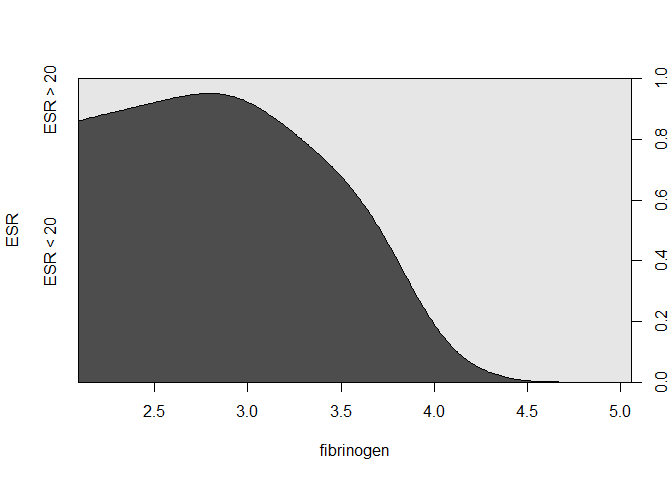

Agresti - [Categorical Data Analysis (2002)](https://mathdept.iut.ac.ir/sites/mathdept.iut.ac.ir/files/AGRESTI.PDF)
-------------------------------------------------------------------------------------------------------------------

-   Sehr intiutiv geschriebenes Buch
-   Sehr ausführliches begleitendes Skript von
    [Thompson](http://statweb.stanford.edu/~owen/courses/306a/Splusdiscrete2.pdf)
-   Das Skript eignet sich um die kategoriale Datenanalyse
    nachzuvollziehen

Faraway Bücher zu Regression in R
---------------------------------

-   Logistische Regressionen gut erklärt
-   Beispiele mit R-code

    -   Faraway - Extending the linear model with r

    -   Faraway - [Practical Regression and Anova using
        R](https://cran.r-project.org/doc/contrib/Faraway-PRA.pdf)

Binäre AVs mit `glm`
--------------------

-   Die [logistische Regression](http://data.princeton.edu/R/glms.html)
    gehört zur Klasse der generalisierten linearen Modelle (GLM)
-   Die Funktion zur Schätzung eines Modells dieser Klasse in heißt
    `glm()`
-   `glm()` muss 1. ein Formel-Objekt mitgegeben werden und 2. die
    Klasse (binomial, gaussian, Gamma) samt link-Funktion (logit,
    probit, cauchit, log, cloglog)

Beispieldaten für die logistische Regression
--------------------------------------------

    install.packages("HSAUR")

    library("HSAUR")
    data("plasma", package = "HSAUR")

Logistische Regression mit R
----------------------------

-   [Kategoriale
    Daten:](http://homepage.univie.ac.at/herbert.nagel/KategorialeDaten.pdf)

<!-- -->

    cdplot(ESR ~ fibrinogen, data = plasma)

[Logistische Regression](http://ww2.coastal.edu/kingw/statistics/R-tutorials/logistic.html) mit R
-------------------------------------------------------------------------------------------------

    plasma_glm_1 <- glm(ESR ~ fibrinogen, data = plasma, 
                        family = binomial())

Weitere Beispieldaten
---------------------

    install.packages("faraway")

    library("faraway")

    data(orings)

<table>
<thead>
<tr class="header">
<th align="right">temp</th>
<th align="right">damage</th>
</tr>
</thead>
<tbody>
<tr class="odd">
<td align="right">53</td>
<td align="right">5</td>
</tr>
<tr class="even">
<td align="right">57</td>
<td align="right">1</td>
</tr>
<tr class="odd">
<td align="right">58</td>
<td align="right">1</td>
</tr>
</tbody>
</table>

Generalisierte Regression mit R - weitere Funktionen
----------------------------------------------------

-   Logistisches Modell mit Probit-Link:

<!-- -->

    probitmod <- glm(cbind(damage,6-damage) ~ temp, 
        family=binomial(link=probit), orings)

-   Regression mit Zähldaten:

<!-- -->

    modp <- glm(Species ~ .,family=poisson,gala)

-   Proportional odds logistic regression im Paket `MASS`:

<!-- -->

    library("MASS")
    house.plr<-polr(Sat~Infl,weights=Freq,data=housing)

Linkliste - logistische Regression
----------------------------------

-   Einführung in [logistische
    Regression](http://ww2.coastal.edu/kingw/statistics/R-tutorials/logistic.html)

-   [Code zum Buch von
    Faraway](http://www.maths.bath.ac.uk/~jjf23/ELM/scripts/binary.R)

