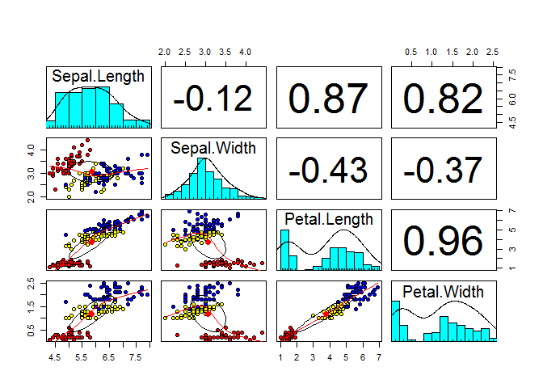

Die Daten laden
---------------

    library(foreign)
    dat <- read.dta("https://github.com/Japhilko/RSocialScience/blob/master/data/GPanel.dta?raw=true")

Eine Kreuztabelle erstellen
---------------------------

    Beruf_Gefordert <- dat$a11c109a
    Beruf_Anerkannt <- dat$a11c111a

    table(Beruf_Gefordert,Beruf_Anerkannt)

    ##                    Beruf_Anerkannt
    ## Beruf_Gefordert     Missing by design Ja Nein Weiß nicht
    ##   Missing by design                93  0    0          0
    ##   Ja                                0  7    0          0
    ##   Nein                              0  0    0          0
    ##   Weiß nicht                        0  0    0          0

Eine Dreidimensionale Kreuztabelle - Array
------------------------------------------

    Geschlecht <- dat$a11d054a
    tab3 <- table(Beruf_Gefordert,Beruf_Anerkannt,Geschlecht)
    tab3

    ## , , Geschlecht = Männlich
    ## 
    ##                    Beruf_Anerkannt
    ## Beruf_Gefordert     Missing by design Ja Nein Weiß nicht
    ##   Missing by design                41  0    0          0
    ##   Ja                                0  2    0          0
    ##   Nein                              0  0    0          0
    ##   Weiß nicht                        0  0    0          0
    ## 
    ## , , Geschlecht = Weiblich
    ## 
    ##                    Beruf_Anerkannt
    ## Beruf_Gefordert     Missing by design Ja Nein Weiß nicht
    ##   Missing by design                52  0    0          0
    ##   Ja                                0  5    0          0
    ##   Nein                              0  0    0          0
    ##   Weiß nicht                        0  0    0          0

Indizieren eines Arrays
-----------------------

-   nun muss man mit zwei Kommas arbeiten beim Indizieren

<!-- -->

    tab3[,,1]

    ##                    Beruf_Anerkannt
    ## Beruf_Gefordert     Missing by design Ja Nein Weiß nicht
    ##   Missing by design                41  0    0          0
    ##   Ja                                0  2    0          0
    ##   Nein                              0  0    0          0
    ##   Weiß nicht                        0  0    0          0

Edgar Anderson's Iris Daten
---------------------------

    data(iris)
    head(iris)

    ##   Sepal.Length Sepal.Width Petal.Length Petal.Width Species
    ## 1          5.1         3.5          1.4         0.2  setosa
    ## 2          4.9         3.0          1.4         0.2  setosa
    ## 3          4.7         3.2          1.3         0.2  setosa
    ## 4          4.6         3.1          1.5         0.2  setosa
    ## 5          5.0         3.6          1.4         0.2  setosa
    ## 6          5.4         3.9          1.7         0.4  setosa

petal length and width - Blütenblatt Länge und Breite

sepal length and width - Kelchblatt Länge und Breite

-   [Wikipedia Artikel zum IRIS
    Datensatz](https://en.wikipedia.org/wiki/Iris_flower_data_set)

Zusammenhang zwischen stetigen Variablen
----------------------------------------

    # Pearson Korrelationskoeffizient
    cor(iris$Sepal.Length,iris$Petal.Length)

    ## [1] 0.8717538

-   Korrelation zwischen Länge Kelchblatt und Blütenblatt 0,87
-   Der Pearson'sche Korrelationskoeffizient ist die default methode in
    `cor()`.

Zusammenhang zwischen mehreren Variablen
----------------------------------------

    pairs(iris[,1:4])

Zusammenhang zwischen mehreren Variablen
----------------------------------------

    library("psych")

    ## Warning: package 'psych' was built under R version 3.3.3

    pairs.panels(iris[1:4],bg=c("red","yellow","blue")
    [iris$Species],pch=21,main="")

Verschiedene Korrelationskoeffizienten
--------------------------------------

    # Pearson Korrelationskoeffizient
    cor(iris[,1:4]) 

    ##              Sepal.Length Sepal.Width Petal.Length Petal.Width
    ## Sepal.Length    1.0000000  -0.1175698    0.8717538   0.8179411
    ## Sepal.Width    -0.1175698   1.0000000   -0.4284401  -0.3661259
    ## Petal.Length    0.8717538  -0.4284401    1.0000000   0.9628654
    ## Petal.Width     0.8179411  -0.3661259    0.9628654   1.0000000

    # Kendall's tau (Rangkorrelation)
    cor(iris[,1:4], method = "kendall") 

    ##              Sepal.Length Sepal.Width Petal.Length Petal.Width
    ## Sepal.Length   1.00000000 -0.07699679    0.7185159   0.6553086
    ## Sepal.Width   -0.07699679  1.00000000   -0.1859944  -0.1571257
    ## Petal.Length   0.71851593 -0.18599442    1.0000000   0.8068907
    ## Petal.Width    0.65530856 -0.15712566    0.8068907   1.0000000

    # Spearman's rho (Rangkorrelation)
    cor(iris[,1:4], method = "spearman") 

    ##              Sepal.Length Sepal.Width Petal.Length Petal.Width
    ## Sepal.Length    1.0000000  -0.1667777    0.8818981   0.8342888
    ## Sepal.Width    -0.1667777   1.0000000   -0.3096351  -0.2890317
    ## Petal.Length    0.8818981  -0.3096351    1.0000000   0.9376668
    ## Petal.Width     0.8342888  -0.2890317    0.9376668   1.0000000

Zusammenhang zwischen kategorialen Variablen
--------------------------------------------

-   `chisq.test()` testet, ob zwei kategoriale Merkmale stochastisch
    unabhängig sind.
-   Getestet wird gegen die Nullhypothese der Gleichverteilung

Levelplot
---------

    library("lattice")

    ## Warning: package 'lattice' was built under R version 3.3.3

    library("AER")

    ## Warning: package 'AER' was built under R version 3.3.3

    ## Warning: package 'lmtest' was built under R version 3.3.3

    data(BankWages)
    levelplot(table(BankWages$education,BankWages$job))

Visualisierung von Zusammenhängen zwischen kategorialen Variablen
-----------------------------------------------------------------

    mosaicplot(~ Sex + Age + Survived, 
               data = Titanic, color = TRUE)

Shading
-------

Flächen werden entsprechend der Residuen eingefärbt:

    mosaicplot(~ Sex + Age + Survived, 
               data = Titanic, shade = TRUE)

Literatur zu Zusammenhangsmaßen
-------------------------------

-   Methodensammlung mit R
-   Beispiele zu Zusammenhangsmaßen
-   Umsetzung in R

Sachs - [Angewandte Statistik mit
R](https://books.google.de/books/about/Angewandte_Statistik.html?id=S-zXmAEACAAJ&redir_esc=y)
