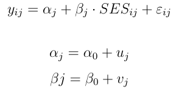

```{r, include=FALSE}
knitr::opts_chunk$set(echo = TRUE)
```

## Wie sehen die Daten aus?

- Beispiel Mehrebenenstruktur der Daten


## [Andres Gutierrez - Multilevel Modeling of Educational Data using R](https://www.r-bloggers.com/multilevel-modeling-of-educational-data-using-r-part-1/)

- Lineare Modelle erkennen den Cluster-Effekt aufgrund der Intraklassen Korrelation nicht


- [Original Blog](http://hagutierrezro.blogspot.de/2016/10/multilevel-modeling-of-educational-data.html)

## Beispiel Mehrebenenmodelle

Untersuchungsgegenstand

- Es sollen die Kenntnisse (Fähigkeiten) von Grundschülern in Mathematik gemessen werden. 
- Dazu werden in einem Schulbezirk zunächst Schulen ausgewählt und anschließend Klassen. 
- Innerhalb der Klassen soll schließlich jeweils eine Stichprobe gezogen und diese getestet werden.

- Geht man zunächst von einer zufälligen Auswahl von Klassen aus, dann ist die Level-1-Variation durch die Schüler und die Level-2-Variation durch die Klassen bestimmt.

## Fragen hierzu

- Wie wäre die Auswahl der Schulen zu berücksichtigen?

- Wie kann zusätzlich eine Unterscheidung nach privaten und staatlichen Schulen in die Modellierung eingebracht werden?

## Beispiel in Goldstein (2010), Kapitel 1.2

Evaluierung der Effektivität von Schulen

Mehrebenen-Modelle:

- Schüler
- Klassenverbände
- Schulamtsbezirke oder Bundesländer


Unterscheidung

- Modelle mit vielen Parametern, die wiederum modelliert werden können
- Regressionen mit Koeffizienten, die zwischen Gruppen variieren können

## Bibliotheken


```{r,eval=F}
# Linear Mixed-Effects Models using 'Eigen' and S4
install.packages("lme4")

# Data Visualization for Statistics in Social Science
install.packages("sjPlot")
```

- Nötige Pakete werden geladen

```{r}
library(ggplot2)

# Miscellaneous Functions for "Grid" Graphics
library(gridExtra)
library(lme4)
library(sjPlot)

# A Grammar of Data Manipulation
library(dplyr)
```

## Beispieldaten

```{r,echo=F}
mlexdat <- read.csv("https://github.com/Japhilko/RSocialScience/raw/master/data/mlexdat.csv") 
```

```{r,eval=F}
mlexdat <- read.csv(
"https://github.com/Japhilko/RSocialScience/
raw/master/data/mlexdat.csv") 
```


```{r,echo=F}
library(knitr)
kable(head(mlexdat))
```


## [Formalistisch](http://kesdev.com/you-got-latex-in-my-markdown/)

- Bei der Analyse von Daten mit diesen hierarchischen Strukturen, sollte man immer zunächst ein Null-Modell anpassen
- Somit kann man die Variation erfassen, die auf die Schulen zurückzuführen ist.

- Das passende Modell sieht folgendermaßen aus:


<!--


$$
y_{ij} = \alpha_{j} + \varepsilon_{ij}

\alpha_{j} = \alpha_0 + u_{j}
$$


-->


Die Gesamtvariation wird in zwei Teile zerlegt: 

- Variation zwischen Schülern (innerhalb der Schulen) und
- zwischen den Schulen (zwischen den Schulen). 


## Der R-code für dieses Nullmodell 

- das einfachste Multilevel Modell
- nach dem vertikalen Strich wird die Gruppen Variable spezifiziert
- die Default Schätzmethode ist restricted maximum likelihood (REML) 
- Man kann aber auch maximum likelihood Schätzung spezifizieren (ML)

```{r}
HLM0 <- lmer(Score ~ (1 | ID), data = mlexdat)
```


## Nullmodell Ergebnis 

```{r}
coef(HLM0)
summary(HLM0)
```


## Interpratation des Nullmodells


- 96 Prozent Variation zwischen den Schulen
- 4 Prozent Variation innerhalb der Schulen


```{r}
100 * 87346 / (87346 + 1931757)
```

- Die Schätzung der zufälligen Effekte zeigt, dass die Variation zwischen den Schulen (Intraklassen Korrelation) fast 96 Prozent beträgt 

- Während der Anteil der Variation zwischen den Studierenden nur etwas mehr als 4 Prozent ausmacht. 

- Das Null-Modell behauptet also , dass Leistungsträger zu bestimmten Schulen gehen und Studierende mit geringerem Leistungsniveau nicht diese Schulen besuchen. 

- Mit anderen Worten, die Schule bestimmt das Testergebnis.

## Ein weiteres Modell

- Das Null Modell schließt keine erklärenden Variablen ein. 
- Allerdings könnte der sozioökonomischen Status (SES) der Schüler auch eine Rolle spielen. 
- Die folgenden Ausdrücke geben ein verfeinertes Modell mit zufälligen Achsenabschnitten und Steigung  für jede der Schulen:


<!--
$$y_{ij} = \alpha_{j} + \beta_{j} * SES_{ij} + \varepsilon_{ij}$$

$$\alpha_{j} = \alpha_0 + u_{j}$$
$$\beta{j} = \beta_0 + v_{j}$$
-->
  
  <!--
  
  -->


## Rcode für dieses Modell


```{r}
HLM1 <- lmer(Score ~ SES + (SES | ID), data = mlexdat)
coef(HLM1)
summary(HLM1)
```

## 

```{r}
# 1% - BS variance
# 99% - WS variance
100 * 40400.24 / (40400.24 + 257.09 + 1.65)

# Percentage of variation explained by SES between schools
1 - ((257.09 + 1.65) / 1931757)

# Percentage of variation explained by SES within schools
1 - (40400.24 / 87346)

```


- die Variable `SES` erklärt 99 Prozent der Unterschiede zwischen den Schulen
- diese Variable `SES` erklärt 53 Prozent der Abweichungen innerhalb der Schulen. 

## Was heißt das? - Schulsegregation 

- wohlhabende Studenten gehören zu reichen Schulen
- arme Studenten gehören zu armen Schulen. 

- Die Leistung der wohlhabenden Studenten ist höher als die der armen Studenten.


## Ein weiteres Beispiel zur [Spezifikation von Multilevel Modellen](http://www.rensenieuwenhuis.nl/r-sessions-16-multilevel-model-specification-lme4/)

- benötigte Bibliotheken:

```{r}
library(lme4)
library(mlmRev)
```

## Der Datensatz

```{r}
data(Exam)
# names(Exam)
```

```{r,echo=F}
library(knitr)
kable(head(Exam))
```


## Zufälliger Intercept und fixed predictor auf individeller Ebene

- Ein Prädiktor wird auf jeder Ebene hinzugefügt 
- Dazu wird die '1' im Nullmodell durch den Prädiktor (hier: `standLRT`) ersetzen. 
- Es wird immer ein Intercept angenommen 
- Da wir nicht wollen, dass der Effekt des Prädiktors zwischen den Gruppen variiert, bleibt die Spezifikation des zufälligen Teils des Modells mit dem vorherigen Modell identisch. 

```{r,eval=F}
lmer(normexam ~ standLRT + (1 | school), data=Exam)
```

## Random intercept, Random slope

- Modell mit zufälligen Intercept auf individueller Ebene und 
- einem Prädiktor, der zwischen Gruppen variieren darf. 

- Mit anderen Worten: die Wirkung der Hausaufgaben auf das Ergebnis der Klausur (Mathe-Test) variiert zwischen den Schulen. 


- Zur Schätzung wird '1' - der Intercept im zufälligen Teil der Modellspezifikation
- ...durch die Variable ersetzt, von der wir den Effekt zwischen den Gruppen variieren wollen.


## [Varying intercept model](https://www.jaredknowles.com/journal/2013/11/25/getting-started-with-mixed-effect-models-in-r)

```{r,eval=F}
MLexamp.6 <- lmer(extro ~ open + agree + social + (1 | school), data = lmm.data)
```

## Varying slope model

```{r,eval=F}
MLexamp.9 <- lmer(extro ~ open + agree + social + (1 + open | school/class), data = lmm.data)
```


<!--
```{r,eval=F}
lmer(y ~ 1 + (1 | subjects), data=data)
# nlme
lme(y ~ 1, random = ~ 1 | subjects, data=data)
```
-->

## Links

- [Paket lmer](https://cran.r-project.org/doc/contrib/Bliese_Multilevel.pdf)
- [Uncertainty in parameter estimates using multilevel models](https://www.r-bloggers.com/uncertainty-in-parameter-estimates-using-multilevel-models/)

- [Multilevel models with R](https://cran.r-project.org/doc/contrib/Bliese_Multilevel.pdf)


- [Ein Beispieldatensatz](https://www.jaredknowles.com/journal/2013/11/25/getting-started-with-mixed-effect-models-in-r)


- [Multilevel Modeling of Educational Data using R (Part 1)](https://www.r-bloggers.com/multilevel-modeling-of-educational-data-using-r-part-1/)

- [Vignette für lme4](https://cran.r-project.org/web/packages/lme4/vignettes/lmer.pdf)

- [Mixed model guide](http://ase.tufts.edu/gsc/gradresources/guidetomixedmodelsinr/mixed%20model%20guide.html)