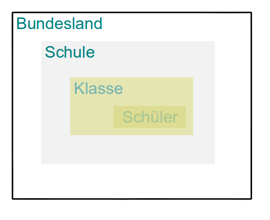

```{r setup, include=FALSE}
knitr::opts_chunk$set(echo = TRUE)
```

## Wie sehen die Daten aus?

- Beispiel Mehrebenenstruktur der Daten




## [Andrés Gutiérrez - Multilevel Modeling of Educational Data using R](https://www.r-bloggers.com/multilevel-modeling-of-educational-data-using-r-part-1/)

- Lineare Modelle erkennen den Cluster-Effekt aufgrund der Intraklassen Korrelation nicht


## Beispiel Mehrebenenmodelle

Untersuchungsgegenstand

- Es sollen die Kenntnisse (Fähigkeiten) von Grundschülern in Mathematik gemessen werden. Dazu werden in einem Schulbezirk zunächst
Schulen ausgewählt und anschließend Klassen. Innerhalb der Klassen soll schließlich jeweils eine Stichprobe gezogen und diese getestet werden.

- Geht man zunächst von einer zufälligen Auswahl von Klassen aus, dann ist die Level-1-Variation durch die Schüler und die Level-2-Variation durch die Klassen bestimmt.

## Fragen hierzu

- Wie wäre die Auswahl der Schulen zu berücksichtigen?

- Wie kann zusätzlich eine Unterscheidung nach privaten und staatlichen Schulen in die Modellierung eingebracht werden?

## Beispiel in Goldstein (2010), Kapitel 1.2

Evaluierung der Effektivität von Schulen

Mehrebenen-Modelle:

- Schüler
- Klassenverbände
- Schulamtsbezirke oder Bundesländer


Unterscheidung

- Modelle mit vielen Parametern, die wiederum modelliert werden können
- Regressionen mit Koeffizienten, die zwischen Gruppen variieren können

## Bibliotheken

```{r}
library(ggplot2)
library(gridExtra)
library(lme4)
library(sjPlot)
library(dplyr)
```

## Beispieldaten erzeugen

```{r}
set.seed(123)
N <- 100 #Number of students per school
sigma <- 200

x1 <- runif(N, 10, 40)
x2 <- runif(N, 25, 55)
x3 <- runif(N, 40, 70)
x4 <- runif(N, 55, 85)
x5 <- runif(N, 70, 100)

y1 <- 20 + 0 * x1 + rnorm(N, 0, sigma)
y2 <- 40 + 10 * x2 + rnorm(N, 0, sigma)
y3 <- 60 + 20 * x3 + rnorm(N, 0, sigma)
y4 <- 80 + 30 * x4 + rnorm(N, 0, sigma)
y5 <- 100 + 40 * x5 + rnorm(N, 0, sigma)

ID <- rep(LETTERS[1:5], each = N)

test <- data.frame(SES = c(x1, x2, x3, x4, x5), 
 Score = c(y1, y2, y3, y4, y5), ID = ID)
```

## Formalistisch

$$
y_{ij} = \alpha_{j} + \varepsilon_{ij}

\alpha_{j} = \alpha_0 + u_{j}
$$


## Mehrebenen Modell - Beispiel 1

- 100 Datenpunkte 

- 4 Gruppen


## Mehrebenen Modell - Beispiel 1


## Basis Regression

- [How to go about interpreting regression cofficients](https://www.r-bloggers.com/how-to-go-about-interpreting-regression-cofficients/)


## [Ein Beispieldatensatz](https://www.jaredknowles.com/journal/2013/11/25/getting-started-with-mixed-effect-models-in-r)

```{r,eval=F}
install.packages("lme4")

# Or to install the dev version
library(devtools)
install_github("lme4", user = "lme4")
```

## [Multilevel Modeling of Educational Data using R (Part 1)](https://www.r-bloggers.com/multilevel-modeling-of-educational-data-using-r-part-1/)

- [Original Blog](http://hagutierrezro.blogspot.de/2016/10/multilevel-modeling-of-educational-data.html)

```{r,eval=F}
install.packages("lme4")
install.packages("sjPlot")
```

## Benötigte Bibliotheken

```{r}
library(ggplot2)
library(gridExtra)
library(lme4)
library(sjPlot)
library(dplyr)
```


## Der Beispieldatensatz

```{r}
set.seed(123)
```

Anzahl der Schüler pro Schule
```{r}
N <- 100 
sigma <- 200

x1 <- runif(N, 10, 40)
x2 <- runif(N, 25, 55)
x3 <- runif(N, 40, 70)
x4 <- runif(N, 55, 85)
x5 <- runif(N, 70, 100)
```

```{r}
y1 <- 20 + 0 * x1 + rnorm(N, 0, sigma)
y2 <- 40 + 10 * x2 + rnorm(N, 0, sigma)
y3 <- 60 + 20 * x3 + rnorm(N, 0, sigma)
y4 <- 80 + 30 * x4 + rnorm(N, 0, sigma)
y5 <- 100 + 40 * x5 + rnorm(N, 0, sigma)

ID <- rep(LETTERS[1:5], each = N)

test <- data.frame(SES = c(x1, x2, x3, x4, x5), 
 Score = c(y1, y2, y3, y4, y5), ID = ID)
```

## Das Nullmodell 

```{r}
HLM0 <- lmer(Score ~ (1 | ID), data = test)
coef(HLM0)
summary(HLM0)
```

- 96% - Between-schools variance
- 4% - Within-schools variance


```{r}
100 * 87346 / (87346 + 1931757)
```

## Formal dargestellt

$$y_{ij} = \alpha_{j} + \beta_{j} * SES_{ij} + \varepsilon_{ij}$$
$$\alpha_{j} = \alpha_0 + u_{j}$$

$$\beta{j} = \beta_0 + v_{j}$$


```{r}
HLM1 <- lmer(Score ~ SES + (SES | ID), data = test)
coef(HLM1)
summary(HLM1)

# 1% - BS variance
# 99% - WS variance
100 * 40400.24 / (40400.24 + 257.09 + 1.65)

# Percentage of variation explained by SES between schools
1 - ((257.09 + 1.65) / 1931757)

# Percentage of variation explained by SES within schools
1 - (40400.24 / 87346)
```


## [Multilevel Model Specification](http://www.rensenieuwenhuis.nl/r-sessions-16-multilevel-model-specification-lme4/)

```{r}
library(lme4)
library(mlmRev)
names(Exam)
```

## Nullmodell

- das einfachste Multilevel Modell
- nach dem vertikalen Strich wird die Gruppen Variable spezifiziert
- die Default Schätzmethode ist restricted maximum likelihood (REML) 
- Man kann aber auch maximum likelihood Schätzung spezifizieren (ML)

```{r}
lmer(normexam ~ 1 + (1 | school), data=Exam)
```


## random intercept, fixed predictor in individual level

- Für das nächste Modell fügen wir dem einzelnen Level einen Prädiktor hinzu. 
- Wir tun dies, indem wir die '1' im Nullmodell durch den Prädiktor (hier: standLRT) ersetzen. 
- Es wird immer ein Intercept angenommen, also wird es noch hier geschätzt. 
- Es muss nur angegeben werden, wenn keine anderen Prädiktoren angegeben sind. 
- Da wir nicht wollen, dass der Effekt des Prädiktors zwischen den Gruppen variiert, bleibt die Spezifikation des zufälligen Teils des Modells mit dem vorherigen Modell identisch. 


## Ein anderes Datenbeispiel

```{r}
library(lme4)  # load library
library(arm)  # convenience functions for regression in R
lmm.data <- read.table("http://www.unt.edu/rss/class/Jon/R_SC/Module9/lmm.data.txt", header = TRUE, sep = ",", na.strings = "NA", dec = ".", strip.white = TRUE)
# summary(lmm.data)
head(lmm.data)
```


## [Varying intercept model](https://www.jaredknowles.com/journal/2013/11/25/getting-started-with-mixed-effect-models-in-r)

```{r}
MLexamp.6 <- lmer(extro ~ open + agree + social + (1 | school), data = lmm.data)
```

## Varying slope model

```{r}
MLexamp.9 <- lmer(extro ~ open + agree + social + (1 + open | school/class), data = lmm.data)
```


## Cross-Level-Interaktionseffekt


## Links

- [Uncertainty in parameter estimates using multilevel models](https://www.r-bloggers.com/uncertainty-in-parameter-estimates-using-multilevel-models/)

- [Multilevel models with R](https://cran.r-project.org/doc/contrib/Bliese_Multilevel.pdf)

## [Paket lmer](https://cran.r-project.org/doc/contrib/Bliese_Multilevel.pdf)

```{r,eval=F}
lmer(y ~ 1 + (1 | subjects), data=data)
# nlme
lme(y ~ 1, random = ~ 1 | subjects, data=data)
```

## Links

- [Multilevel Modeling of Educational Data using R (Part 1)](https://www.r-bloggers.com/multilevel-modeling-of-educational-data-using-r-part-1/)

- [Vignette für lme4](https://cran.r-project.org/web/packages/lme4/vignettes/lmer.pdf)

- [Mixed model guide](http://ase.tufts.edu/gsc/gradresources/guidetomixedmodelsinr/mixed%20model%20guide.html)