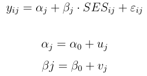

Wie sehen die Daten aus?
------------------------

-   Beispiel Mehrebenenstruktur der Daten


[Andres Gutierrez - Multilevel Modeling of Educational Data using R](https://www.r-bloggers.com/multilevel-modeling-of-educational-data-using-r-part-1/)
--------------------------------------------------------------------------------------------------------------------------------------------------------

-   Lineare Modelle erkennen den Cluster-Effekt aufgrund der
    Intraklassen Korrelation nicht


-   [Original
    Blog](http://hagutierrezro.blogspot.de/2016/10/multilevel-modeling-of-educational-data.html)

Beispiel Mehrebenenmodelle
--------------------------

Untersuchungsgegenstand

-   Es sollen die Kenntnisse (Fähigkeiten) von Grundschülern in
    Mathematik gemessen werden.
-   Dazu werden in einem Schulbezirk zunächst Schulen ausgewählt und
    anschließend Klassen.
-   Innerhalb der Klassen soll schließlich jeweils eine Stichprobe
    gezogen und diese getestet werden.

-   Geht man zunächst von einer zufälligen Auswahl von Klassen aus, dann
    ist die Level-1-Variation durch die Schüler und die
    Level-2-Variation durch die Klassen bestimmt.

Fragen hierzu
-------------

-   Wie wäre die Auswahl der Schulen zu berücksichtigen?

-   Wie kann zusätzlich eine Unterscheidung nach privaten und
    staatlichen Schulen in die Modellierung eingebracht werden?

Beispiel in Goldstein (2010), Kapitel 1.2
-----------------------------------------

Evaluierung der Effektivität von Schulen

Mehrebenen-Modelle:

-   Schüler
-   Klassenverbände
-   Schulamtsbezirke oder Bundesländer

Unterscheidung

-   Modelle mit vielen Parametern, die wiederum modelliert werden können
-   Regressionen mit Koeffizienten, die zwischen Gruppen variieren
    können

Bibliotheken
------------

    # Linear Mixed-Effects Models using 'Eigen' and S4
    install.packages("lme4")

    # Data Visualization for Statistics in Social Science
    install.packages("sjPlot")

-   Nötige Pakete werden geladen

<!-- -->

    library(ggplot2)
    # Miscellaneous Functions for "Grid" Graphics
    library(gridExtra)
    library(lme4)

    ## Loading required package: Matrix

    library(sjPlot)
    # A Grammar of Data Manipulation
    library(dplyr)

    ## 
    ## Attaching package: 'dplyr'

    ## The following object is masked from 'package:gridExtra':
    ## 
    ##     combine

    ## The following objects are masked from 'package:stats':
    ## 
    ##     filter, lag

    ## The following objects are masked from 'package:base':
    ## 
    ##     intersect, setdiff, setequal, union

Beispieldaten
-------------

    mlexdat <- read.csv(
    "https://github.com/Japhilko/RSocialScience/
    raw/master/data/mlexdat.csv") 

<table>
<thead>
<tr class="header">
<th align="right">X</th>
<th align="right">SES</th>
<th align="right">Score</th>
<th align="left">ID</th>
</tr>
</thead>
<tbody>
<tr class="odd">
<td align="right">1</td>
<td align="right">18.62733</td>
<td align="right">-55.120574</td>
<td align="left">A</td>
</tr>
<tr class="even">
<td align="right">2</td>
<td align="right">33.64915</td>
<td align="right">-92.375273</td>
<td align="left">A</td>
</tr>
<tr class="odd">
<td align="right">3</td>
<td align="right">22.26931</td>
<td align="right">-48.783447</td>
<td align="left">A</td>
</tr>
<tr class="even">
<td align="right">4</td>
<td align="right">36.49052</td>
<td align="right">38.099329</td>
<td align="left">A</td>
</tr>
<tr class="odd">
<td align="right">5</td>
<td align="right">38.21402</td>
<td align="right">339.701754</td>
<td align="left">A</td>
</tr>
<tr class="even">
<td align="right">6</td>
<td align="right">11.36669</td>
<td align="right">2.286978</td>
<td align="left">A</td>
</tr>
</tbody>
</table>

[Formalistisch](http://kesdev.com/you-got-latex-in-my-markdown/)
----------------------------------------------------------------

-   Bei der Analyse von Daten mit diesen hierarchischen Strukturen,
    sollte man immer zunächst ein Null-Modell anpassen
-   Somit kann man die Variation erfassen, die auf die Schulen
    zurückzuführen ist.

-   Das passende Modell sieht folgendermaßen aus:


<!--


$$
y_{ij} = \alpha_{j} + \varepsilon_{ij}

\alpha_{j} = \alpha_0 + u_{j}
$$


-->

Die Gesamtvariation wird in zwei Teile zerlegt:

-   Variation zwischen Schülern (innerhalb der Schulen) und
-   zwischen den Schulen (zwischen den Schulen).

Der R-code für dieses Nullmodell
--------------------------------

-   das einfachste Multilevel Modell
-   nach dem vertikalen Strich wird die Gruppen Variable spezifiziert
-   die Default Schätzmethode ist restricted maximum likelihood (REML)
-   Man kann aber auch maximum likelihood Schätzung spezifizieren (ML)

<!-- -->

    HLM0 <- lmer(Score ~ (1 | ID), data = mlexdat)

Nullmodell Ergebnis - Koeffizienten
-----------------------------------

    coef(HLM0)

    ## $ID
    ##   (Intercept)
    ## A     45.7893
    ## B    430.7218
    ## C   1182.1760
    ## D   2145.2329
    ## E   3489.1408
    ## 
    ## attr(,"class")
    ## [1] "coef.mer"

Nullmodell Ergebnis - Zusammenfassung
-------------------------------------

    summary(HLM0)

    ## Linear mixed model fit by REML ['lmerMod']
    ## Formula: Score ~ (1 | ID)
    ##    Data: mlexdat
    ## 
    ## REML criterion at convergence: 7130.6
    ## 
    ## Scaled residuals: 
    ##      Min       1Q   Median       3Q      Max 
    ## -2.74559 -0.69317 -0.00757  0.68337  2.96511 
    ## 
    ## Random effects:
    ##  Groups   Name        Variance Std.Dev.
    ##  ID       (Intercept) 1931758  1389.9  
    ##  Residual               87346   295.5  
    ## Number of obs: 500, groups:  ID, 5
    ## 
    ## Fixed effects:
    ##             Estimate Std. Error t value
    ## (Intercept)   1458.6      621.7   2.346

Interpratation des Nullmodells
------------------------------

-   96 Prozent Variation zwischen den Schulen
-   4 Prozent Variation innerhalb der Schulen

<!-- -->

    100 * 87346 / (87346 + 1931757)

    ## [1] 4.32598

-   Die Schätzung der zufälligen Effekte zeigt, dass die Variation
    zwischen den Schulen (Intraklassen Korrelation) fast 96 Prozent
    beträgt

-   Während der Anteil der Variation zwischen den Studierenden nur etwas
    mehr als 4 Prozent ausmacht.

-   Das Null-Modell behauptet also , dass Leistungsträger zu bestimmten
    Schulen gehen und Studierende mit geringerem Leistungsniveau nicht
    diese Schulen besuchen.

-   Mit anderen Worten, die Schule bestimmt das Testergebnis.

Ein weiteres Modell
-------------------

-   Das Null Modell schließt keine erklärenden Variablen ein.
-   Allerdings könnte der sozioökonomischen Status (SES) der Schüler
    auch eine Rolle spielen.
-   Die folgenden Ausdrücke geben ein verfeinertes Modell mit zufälligen
    Achsenabschnitten und Steigung für jede der Schulen.

<!--


$$y_{ij} = \alpha_{j} + \beta_{j} * SES_{ij} + \varepsilon_{ij}$$

$$\alpha_{j} = \alpha_0 + u_{j}$$
$$\beta{j} = \beta_0 + v_{j}$$
-->
<!--
  
  -->

Rcode für dieses Modell
-----------------------

    HLM1 <- lmer(Score ~ SES + (SES | ID), data = mlexdat)
    coef(HLM1)

    ## $ID
    ##   (Intercept)        SES
    ## A    36.46401  0.3798185
    ## B    37.21549  9.7596237
    ## C    38.10719 20.8897245
    ## D    38.85566 30.2320132
    ## E    39.70159 40.7907386
    ## 
    ## attr(,"class")
    ## [1] "coef.mer"

Zusammenfassung zweites Modell
------------------------------

    summary(HLM1)

    ## Linear mixed model fit by REML ['lmerMod']
    ## Formula: Score ~ SES + (SES | ID)
    ##    Data: mlexdat
    ## 
    ## REML criterion at convergence: 6742.1
    ## 
    ## Scaled residuals: 
    ##      Min       1Q   Median       3Q      Max 
    ## -2.83274 -0.64740  0.02662  0.69063  2.67309 
    ## 
    ## Random effects:
    ##  Groups   Name        Variance Std.Dev. Corr
    ##  ID       (Intercept)     1.65   1.285      
    ##           SES           257.09  16.034  1.00
    ##  Residual             40400.24 200.998      
    ## Number of obs: 500, groups:  ID, 5
    ## 
    ## Fixed effects:
    ##             Estimate Std. Error t value
    ## (Intercept)   38.069     45.863   0.830
    ## SES           20.410      7.236   2.821
    ## 
    ## Correlation of Fixed Effects:
    ##     (Intr)
    ## SES -0.119

    # 1% - BS variance
    # 99% - WS variance
    100 * 40400.24 / (40400.24 + 257.09 + 1.65)

    ## [1] 99.36363

    # Percentage of variation explained by SES between schools
    1 - ((257.09 + 1.65) / 1931757)

    ## [1] 0.9998661

    # Percentage of variation explained by SES within schools
    1 - (40400.24 / 87346)

    ## [1] 0.5374689

-   die Variable `SES` erklärt 99 Prozent der Unterschiede zwischen den
    Schulen
-   diese Variable `SES` erklärt 53 Prozent der Abweichungen innerhalb
    der Schulen.

Was heißt das? - Schulsegregation
---------------------------------

-   wohlhabende Studenten gehören zu reichen Schulen
-   arme Studenten gehören zu armen Schulen.

-   Die Leistung der wohlhabenden Studenten ist höher als die der
    armen Studenten.

Ein weiteres Beispiel zur [Spezifikation von Multilevel Modellen](http://www.rensenieuwenhuis.nl/r-sessions-16-multilevel-model-specification-lme4/)
----------------------------------------------------------------------------------------------------------------------------------------------------

-   benötigte Bibliotheken:

<!-- -->

    library(lme4)
    library(mlmRev)

Der Datensatz
-------------

    data(Exam)
    # names(Exam)

<table>
<thead>
<tr class="header">
<th align="left">school</th>
<th align="right">normexam</th>
<th align="left">schgend</th>
<th align="right">schavg</th>
<th align="left">vr</th>
<th align="left">intake</th>
<th align="right">standLRT</th>
<th align="left">sex</th>
<th align="left">type</th>
<th align="left">student</th>
</tr>
</thead>
<tbody>
<tr class="odd">
<td align="left">1</td>
<td align="right">0.2613242</td>
<td align="left">mixed</td>
<td align="right">0.1661752</td>
<td align="left">mid 50%</td>
<td align="left">bottom 25%</td>
<td align="right">0.6190592</td>
<td align="left">F</td>
<td align="left">Mxd</td>
<td align="left">143</td>
</tr>
<tr class="even">
<td align="left">1</td>
<td align="right">0.1340672</td>
<td align="left">mixed</td>
<td align="right">0.1661752</td>
<td align="left">mid 50%</td>
<td align="left">mid 50%</td>
<td align="right">0.2058022</td>
<td align="left">F</td>
<td align="left">Mxd</td>
<td align="left">145</td>
</tr>
<tr class="odd">
<td align="left">1</td>
<td align="right">-1.7238820</td>
<td align="left">mixed</td>
<td align="right">0.1661752</td>
<td align="left">mid 50%</td>
<td align="left">top 25%</td>
<td align="right">-1.3645760</td>
<td align="left">M</td>
<td align="left">Mxd</td>
<td align="left">142</td>
</tr>
<tr class="even">
<td align="left">1</td>
<td align="right">0.9675862</td>
<td align="left">mixed</td>
<td align="right">0.1661752</td>
<td align="left">mid 50%</td>
<td align="left">mid 50%</td>
<td align="right">0.2058022</td>
<td align="left">F</td>
<td align="left">Mxd</td>
<td align="left">141</td>
</tr>
<tr class="odd">
<td align="left">1</td>
<td align="right">0.5443412</td>
<td align="left">mixed</td>
<td align="right">0.1661752</td>
<td align="left">mid 50%</td>
<td align="left">mid 50%</td>
<td align="right">0.3711052</td>
<td align="left">F</td>
<td align="left">Mxd</td>
<td align="left">138</td>
</tr>
<tr class="even">
<td align="left">1</td>
<td align="right">1.7348992</td>
<td align="left">mixed</td>
<td align="right">0.1661752</td>
<td align="left">mid 50%</td>
<td align="left">bottom 25%</td>
<td align="right">2.1894372</td>
<td align="left">M</td>
<td align="left">Mxd</td>
<td align="left">155</td>
</tr>
</tbody>
</table>

Zufälliger Intercept und fixed predictor auf individeller Ebene
---------------------------------------------------------------

-   Ein Prädiktor wird auf jeder Ebene hinzugefügt
-   Dazu wird die '1' im Nullmodell durch den Prädiktor (hier:
    `standLRT`) ersetzen.
-   Es wird immer ein Intercept angenommen
-   Da wir nicht wollen, dass der Effekt des Prädiktors zwischen den
    Gruppen variiert, bleibt die Spezifikation des zufälligen Teils des
    Modells mit dem vorherigen Modell identisch.

<!-- -->

    lmer(normexam ~ standLRT + (1 | school), data=Exam)

Random intercept, Random slope
------------------------------

-   Modell mit zufälligen Intercept auf individueller Ebene und
-   einem Prädiktor, der zwischen Gruppen variieren darf.

-   Mit anderen Worten: die Wirkung der Hausaufgaben auf das Ergebnis
    der Klausur (Mathe-Test) variiert zwischen den Schulen.

-   Zur Schätzung wird '1' - der Intercept im zufälligen Teil der
    Modellspezifikation
-   ...durch die Variable ersetzt, von der wir den Effekt zwischen den
    Gruppen variieren wollen.

[Varying intercept model](https://www.jaredknowles.com/journal/2013/11/25/getting-started-with-mixed-effect-models-in-r)
------------------------------------------------------------------------------------------------------------------------

    MLexamp.6<-lmer(extro~open+agree+ social + (1 | school), 
                    data = lmm.data)

Varying slope model
-------------------

    MLexamp.9<-lmer(extro~open + agree + social + 
                      (1 + open | school/class), 
                    data = lmm.data)

<!--

```r
lmer(y ~ 1 + (1 | subjects), data=data)
# nlme
lme(y ~ 1, random = ~ 1 | subjects, data=data)
```
-->
Links
-----

-   [Paket
    lmer](https://cran.r-project.org/doc/contrib/Bliese_Multilevel.pdf)
-   [Uncertainty in parameter estimates using multilevel
    models](https://www.r-bloggers.com/uncertainty-in-parameter-estimates-using-multilevel-models/)

-   [Multilevel models with
    R](https://cran.r-project.org/doc/contrib/Bliese_Multilevel.pdf)

-   [Ein
    Beispieldatensatz](https://www.jaredknowles.com/journal/2013/11/25/getting-started-with-mixed-effect-models-in-r)

-   [Multilevel Modeling of Educational Data using R
    (Part 1)](https://www.r-bloggers.com/multilevel-modeling-of-educational-data-using-r-part-1/)

-   [Vignette für
    lme4](https://cran.r-project.org/web/packages/lme4/vignettes/lmer.pdf)

-   [Mixed model
    guide](http://ase.tufts.edu/gsc/gradresources/guidetomixedmodelsinr/mixed%20model%20guide.html)
