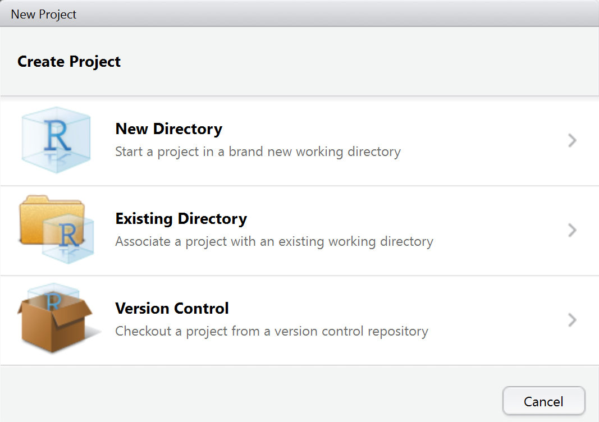
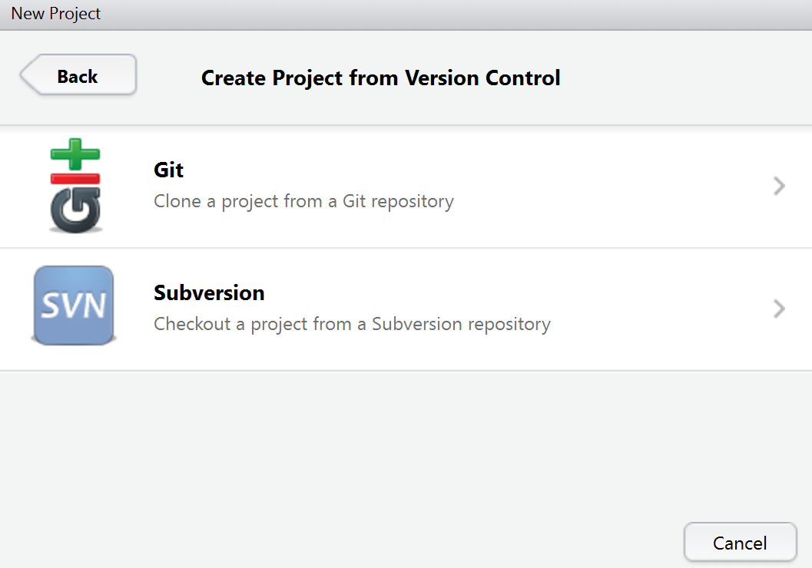

```{r, include=FALSE}
knitr::opts_chunk$set(echo = TRUE)
```

## Rstudio und git - ein Projekt anlegen


## Ein Projekt mit Versionskontrolle




## Auswahl Versionskontrolle




## Ein Projekt clonen


