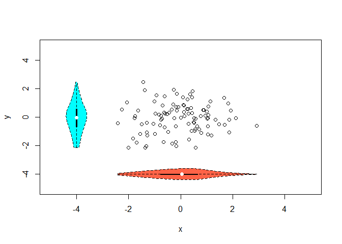

Ein Plot sagt mehr als 1000 Worte
---------------------------------

-   Grafisch gestützte Datenanalyse ist toll
-   Gute Plots können zu einem besseren Verständnis beitragen
-   Einen Plot zu generieren geht schnell
-   Einen guten Plot zu machen kann sehr lange dauern
-   Mit R Plots zu generieren macht Spaß
-   Mit R erstellte Plots haben hohe Qualität
-   Fast jeder Plottyp wird von R unterstützt
-   R kennt eine große Menge an Exportformaten für Grafiken

Plot ist nicht gleich Plot
--------------------------

-   Bereits das base Package bringt eine große Menge von Plot Funktionen
    mit
-   Das lattice Packet erweitert dessen Funktionalität
-   Eine weit über diese Einführung hinausgehende Übersicht findet sich
    in Murrell, P (2006): R Graphics.

Task View zu Thema [Graphiken](https://cran.r-project.org/web/views/Graphics.html)
----------------------------------------------------------------------------------

Datensatz
---------

    library(mlmRev)
    data(Chem97)

-   \[lea\] Local Education Authority - a factor
-   \[school\] School identifier - a factor
-   \[student\] Student identifier - a factor
-   \[score\] Point score on A-level Chemistry in 1997
-   \[gender\] Student's gender
-   \[age\] Age in month, centred at 222 months or 18.5 years
-   \[gcsescore\] Average GCSE score of individual.
-   \[gcsecnt\] Average GCSE score of individual, centered at mean.

Histogramm - Die Funktion hist()
--------------------------------

Wir erstellen ein Histogramm der Variable gcsescore:

    ?hist

    hist(Chem97$gcsescore)

Graphik speichern
-----------------

-   Mit dem button Export in Rstudio kann man die Grafik speichern.

Befehl um Graphik zu speichern
------------------------------

-   Alternativ auch bspw. mit den Befehlen `png`, `pdf` oder `jpeg`

<!-- -->

    png("Histogramm.png")
    hist(Chem97$gcsescore)
    dev.off()

Histogramme
-----------

-   Die Funktion `hist()` plottet ein Histogramm der Daten
-   Der Funktion muss mindestens ein Beobachtungsvektor übergeben werden
-   `hist()` hat noch sehr viel mehr Argumente, die alle (sinnvolle)
    default values haben

<table>
<thead>
<tr class="header">
<th align="left">Argument</th>
<th align="left">Bedeutung</th>
<th align="left">Beispiel</th>
</tr>
</thead>
<tbody>
<tr class="odd">
<td align="left">main</td>
<td align="left">Überschrift</td>
<td align="left">main=&quot;Hallo Welt&quot;</td>
</tr>
<tr class="even">
<td align="left">xlab</td>
<td align="left">x-Achsenbeschriftung</td>
<td align="left">xlab=&quot;x-Werte&quot;</td>
</tr>
<tr class="odd">
<td align="left">ylab</td>
<td align="left">y-Achsenbeschriftung</td>
<td align="left">ylab=&quot;y-Werte&quot;</td>
</tr>
<tr class="even">
<td align="left">col</td>
<td align="left">Farbe</td>
<td align="left">col=&quot;blue&quot;</td>
</tr>
</tbody>
</table>

Histogramm
----------

    hist(Chem97$gcsescore,col="blue",
         main="Hallo Welt",ylab="y-Werte", xlab="x-Werte")

Weitere Argumente:

    ?plot
    # oder
    ?par

Barplot
-------

-   Die Funktion `barplot()` erzeugt aus einer Häufigkeitstabelle einen
    Barplot
-   Ist das übergebene Tabellen-Objekt zweidimensional wird ein
    bedingter Barplot erstellt

<!-- -->

    tabScore <- table(Chem97$score)

    barplot(tabScore)

Barplots und barcharts
----------------------

    barplot(tabScore)

Mehr Farben:
------------

    barplot(tabScore,col=rgb(0,0,1))

Grüne Farbe
-----------

    barplot(tabScore,col=rgb(0,1,0))

Rote Farbe
----------

    barplot(tabScore,col=rgb(1,0,0))

Transparent
-----------

    barplot(tabScore,col=rgb(1,0,0,.3))

Boxplot
-------

-   Einen einfachen Boxplot erstellt man mit `boxplot()`
-   Auch `boxplot()` muss mindestens ein Beobachtungsvektor übergeben
    werden

<!-- -->

    ?boxplot

Horizontaler Boxplot
--------------------

    boxplot(Chem97$gcsescore,
    horizontal=TRUE)

-   [Erklärung zu
    Boxplots](http://edoc.hu-berlin.de/dissertationen/gruenwald-andreas-2005-01-17/HTML/chapter2.html)

Gruppierte Boxplots
-------------------

-   Ein sehr einfacher Weg, einen ersten Eindruck über bedingte
    Verteilungen zu bekommen ist über sog. Gruppierte notched Boxplots
-   Dazu muss der Funktion `boxplot()` ein sog. Formel-Objekt übergeben
    werden
-   Die bedingende Variable steht dabei auf der rechten Seite einer
    Tilde

Beispiel grupierter Boxplot
---------------------------

    boxplot(Chem97$gcsescore~Chem97$gender)

Alternativen zu Boxplot
-----------------------

Violinplot

-   Baut auf Boxplot auf
-   Zusätzlich Informationen über Dichte der Daten
-   Dichte wird über Kernel Methode berechnet.
-   weißer Punkt - Median
-   Je weiter die Ausdehnung, desto größer ist die Dichte an
    dieser Stelle.

<!-- -->

    # Beispieldaten erzeugen
    x <- rnorm(100)
    y <- rnorm(100)

Die Bibliothek `vioplot`
------------------------

    library(vioplot)
    plot(x, y, xlim=c(-5,5), ylim=c(-5,5))
    vioplot(x, col="tomato", horizontal=TRUE, at=-4, 
            add=TRUE,lty=2, rectCol="gray")
    vioplot(y, col="cyan", horizontal=FALSE, at=-4, 
            add=TRUE,lty=2)

`vioplot` - Das Ergebnis
------------------------

Alternativen zum Boxplot
------------------------

    library(beanplot)
    par(mfrow = c(1,2))
    boxplot(count~spray,data=InsectSprays,col="blue")
    beanplot(count~spray,data=InsectSprays,col="orange")

Grafiken für bedingte, bi- und multivariate Verteilungen
========================================================

Scatterplots
------------

-   Ein einfacher two-way scatterplot kann mit der Funktion plot()
    erstellt werden
-   plot() muss mindestens ein x und ein y Beobachtungsvektor übergeben
    werden
-   Um die Farbe der Plot-Symbole anzupassen gibt es die Option col
    (Farbe als character oder numerisch)
-   Die Plot-Symbole selbst können mit pch} (plotting character)
    angepasst werden (character oder numerisch)
-   Die Achenbeschriftungen (labels) werden mit xlab und ylab definiert
